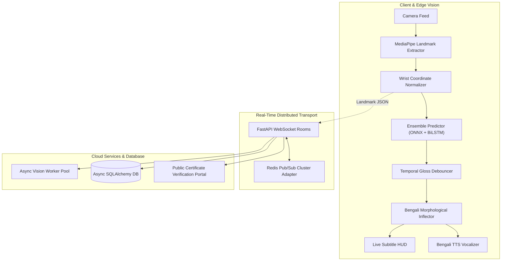

# IsharaConnect (ইশারা কানেক্ট)

> **Real-Time Bangla Sign Language (BdSL) Continuous NLP Translation & Two-Way Communication Platform**

[](https://www.python.org/downloads/)
[](https://fastapi.tiangolo.com)
[](https://www.riverbankcomputing.com/software/pyqt/)
[](https://developers.google.com/mediapipe)
[](https://onnxruntime.ai/)
[](https://redis.io/)
[](LICENSE)

---

## 🌟 Overview

**IsharaConnect** is an enterprise-grade, real-time two-way communication system designed to eliminate the communication barrier between Deaf/Hard-of-Hearing individuals (who use **Bangla Sign Language - BdSL**) and the hearing population across Bangladesh and global Bengali-speaking communities.

Unlike traditional high-bandwidth video streaming platforms, IsharaConnect performs **edge landmark extraction** (MediaPipe Holistic/Hands), applies **wrist-origin coordinate normalization**, and transmits lightweight telemetry vectors (~2–5 KB/s) over distributed WebSockets. Real-time inference pipelines convert gestures into grammatically inflected Bengali sentences with synchronized Bengali Text-to-Speech (TTS), while spoken hearing replies are transcribed and animated via 3D/2D visual gesture avatars.

---

## 🚀 Core Capabilities

### 1. 🖐️ Edge Vision & Multi-Tier AI Inference
- **Isolated Sign Recognition (ISLR)**: Sub-15ms classification using ONNX Runtime with confidence gating and OOD rejection.
- **Continuous Sign Language Recognition (CSLR)**: Temporal BiLSTM sequence modeling for dynamic continuous signing.
- **Sign Language Translation (SLT)**: Continuous gloss stream debouncing and grammatical morphological inflection (Vibhakti, person agreement, verb conjugation).

### 2. 📺 Live Subtitle HUD & Automated Bengali TTS
- **Glassmorphic Floating HUD**: Displays real-time stabilized gloss chips in glowing amber badges and continuous Bengali sentences in vibrant emerald typography.
- **Zero-Latency Vocalizer**: Triggers high-fidelity Bengali speech synthesis upon gesture sentence boundary finalization without GUI blocking.

### 3. 🌐 Distributed Scalability & WebRTC Web Client
- **Distributed Redis Pub/Sub**: Scales WebSocket communication rooms across multiple Uvicorn worker nodes and Docker containers with automatic in-memory fallback.
- **Async Vision Worker Pool**: Non-blocking bounded queues with automatic stale-frame dropping for multi-user WebRTC landmark streaming.

### 4. 🎓 BdSL Academy & Public Certificate Verification
- **Interactive Academy**: 3-Column structured curriculum across Foundations, Conversational, Medical & Emergency BdSL.
- **Certification Exam**: Automated 10-question evaluation (5 Visual MCQs + 5 Live Camera Posture Holds).
- **Public Certificate Verification Portal**: Verifiable QR codes and tamper-proof SHA-256 certificates with Jinja2 verification pages.

---

## 🧠 System Architecture



---

## 🛠️ Quick Start

### 1. Prerequisites
- Python 3.10, 3.11, or 3.12
- Camera / Webcam device
- Git

### 2. Installation
```powershell
# Clone repository
git clone https://github.com/farhanshahriarpolok/IsharaConnect.git
cd IsharaConnect

# Set up virtual environment
python -m venv .venv
.venv\Scripts\activate

# Install dependencies
pip install -r requirements.txt
pip install -r requirements-dev.txt
```

### 3. Launching IsharaConnect
```powershell
# Unified Full-Stack Launcher (Backend Server + Desktop GUI)
python launch.py

# Launch Desktop Client only
python -m desktop_app.main

# Launch Backend Server only
uvicorn backend.main:app --host 0.0.0.0 --port 8000 --reload
```

---

## 🧪 Testing & Verification

IsharaConnect maintains 100% automated test coverage across all subsystems:

```powershell
# Run full unit test suite (242+ tests)
pytest tests/unit/

# Run Master Release Smoke Test
python scripts/smoke_test_release.py
```

---

## 📦 Master Release Packaging

Build the standalone Windows portable distribution:
```powershell
python scripts/build_windows_exe.py
```
Executable output: `dist/IsharaConnect/IsharaConnect.exe`

---

## 📄 License
This project is licensed under the MIT License. See [LICENSE](LICENSE) for details.
