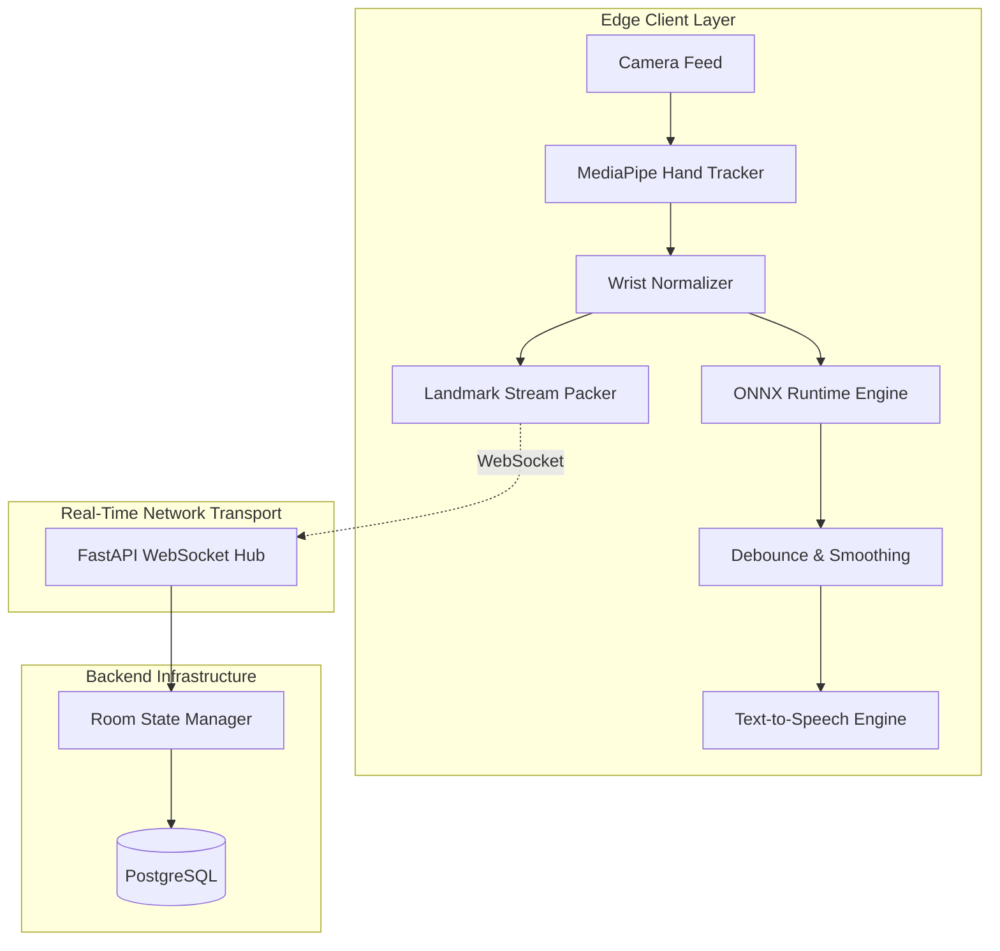

# IsharaConnect (ইশারা কানেক্ট)

> **Real-Time Bangla Sign Language (BdSL) Two-Way Communication Platform**

[](https://www.python.org/downloads/)
[](https://fastapi.tiangolo.com)
[](https://developers.google.com/mediapipe)
[](https://onnxruntime.ai/)
[](LICENSE)

---

## 🌟 Overview

**IsharaConnect** is an accessible, real-time two-way communication system designed to eliminate the communication barrier between Deaf/Hard-of-Hearing individuals (who use **Bangla Sign Language - BdSL**) and the hearing population in Bangladesh.

Unlike traditional high-bandwidth video streaming systems, IsharaConnect extracts **21 3D hand keypoints per hand** on edge devices, applies **wrist-origin coordinate normalization**, and transmits lightweight telemetry vectors (~2-5 KB/s) over real-time WebSockets, synthesizing recognized signs into **Bengali Text-to-Speech (TTS)** and transcribing spoken replies into live transcripts.

---

## 🚀 Core Features

- **Real-Time BdSL Gesture Recognition**: High-accuracy edge inference on static handshapes and dynamic temporal gestures.
- **Low-Bandwidth Landmark Streaming**: Over 99% bandwidth reduction compared to video streams; works smoothly on 3G/4G cellular connections.
- **Bidirectional Speech & Text**:
  - *Deaf User*: Signs in BdSL $\rightarrow$ Emits Bangla text & spoken audio (TTS).
  - *Hearing User*: Speaks in Bangla/English $\rightarrow$ Emits live transcription & visual gloss feedback.
- **Duplex WebSocket Chat Rooms**: Sub-50ms sync latency for instant peer-to-peer and group room communication.
- **Admin-in-the-Loop Retraining Queue**: Certified linguists validate crowdsourced signs to continuously expand the BdSL vocabulary.
- **Cross-Platform Architecture**: Desktop client (PyQt6) progressing to Web and Android.

---

## 🧠 System Architecture



---

## 🛠️ Quick Start & Setup

### 1. Prerequisites
- Python 3.10 or 3.11
- Webcam / Camera Device
- PostgreSQL (for backend services)

### 2. Environment Setup
```bash
# Create & activate virtual environment
python -m venv .venv
source .venv/bin/activate  # On Windows: .venv\Scripts\Activate.ps1

# Install dependencies
pip install -r requirements.txt
pip install -r requirements-dev.txt
```

### 3. Record Baseline Sign Landmarks
```bash
# Interactive sign selection
python scripts/collect_landmarks.py --interactive

# Record specific sign
python scripts/collect_landmarks.py --label dhonnobad --samples 50
```

### 4. Run Unit Tests
```bash
pytest -v
```

---

## 📄 License
This project is licensed under the MIT License.
