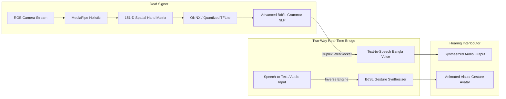

# 🏆 IsharaConnect (ইশারা কানেক্ট)
## National ICT Innovation & Digital Inclusion Award Pitch Deck

> **Project Mission:** Bridging the Communication Divide for over 3 Million Deaf & Hard-of-Hearing Citizens in Bangladesh through Real-Time, Edge-Optimized Bangla Sign Language (BdSL) Artificial Intelligence.

---

```
  ██╗███████╗██╗  ██╗ █████╗ ██████╗  █████╗  ██████╗ ██████╗ ███╗   ██╗███╗   ██╗███████╗ ██████╗████████╗
  ██║██╔════╝██║  ██║██╔══██╗██╔══██╗██╔══██╗██╔════╝██╔═══██╗████╗  ██║████╗  ██║██╔════╝██╔════╝╚══██╔══╝
  ██║███████╗███████║███████║██████╔╝███████║██║     ██║   ██║██╔██╗ ██║██╔██╗ ██║█████╗  ██║        ██║   
  ██║╚════██║██╔══██║██╔══██║██╔══██╗██╔══██║██║     ██║   ██║██║╚██╗██║██║╚██╗██║██╔══╝  ██║        ██║   
  ██║███████║██║  ██║██║  ██║██║  ██║██║  ██║╚██████╗╚██████╔╝██║ ╚████║██║ ╚████║███████╗╚██████╗   ██║   
  ╚═╝╚══════╝╚═╝  ╚═╝╚═╝  ╚═╝╚═╝  ╚═╝╚═╝  ╚═╝ ╚═════╝ ╚═════╝ ╚═╝  ╚═══╝╚═╝  ╚═══╝╚══════╝ ╚═════╝   ╚═╝   
```

---

## 1. Executive Summary & Problem Statement

### The 3-Million Voice Inclusion Crisis
In Bangladesh, more than **3,000,000 Deaf and speech-impaired individuals** face severe, daily institutional disenfranchisement:
- **Medical Emergency Barrier:** Deaf patients cannot communicate critical symptoms during triage at public hospitals, leading to misdiagnosis or fatal delays.
- **Law Enforcement & Civic Exclusion:** Inability to file General Diaries (GD) or report distress at police stations (থানা) without certified third-party interpreters.
- **Financial Dependency:** Inability to navigate standard banking, ATM, or public welfare counters independently.
- **Acute Interpreter Shortage:** There are fewer than **120 certified BdSL interpreters** nationwide—a staggering ratio of **1 interpreter per 25,000 Deaf citizens**.

---

## 2. Core Technological Innovations (Indigenous AI)

| Traditional Sign Systems (ASL) | IsharaConnect BdSL Breakthrough | Impact |
|:---|:---|:---|
| **Single-Hand Models (126-D)** | **151-D Dual-Hand Spatial Matrix** | Captures essential inter-hand contact points (৫x৫ স্পর্শ ম্যাট্রিক্স) unique to BdSL grammar. |
| **Heavy Cloud GPUs required (>500ms latency)** | **Sub-5MB Quantized Edge Engine (0.87MB)** | Runs locally at **1.71 ms inference latency** on standard low-cost laptops and mobile devices. |
| **Literal Word-by-Word Subtitles** | **Continuous Grammar NLP (Morphological Inflections)** | Smooths raw glosses (`[আমি, ডাক্তার, যাওয়া, প্রয়োজন]` $\rightarrow$ `"আমার ডাক্তারের কাছে যাওয়া প্রয়োজন।" / "I need to visit a doctor."`). |
| **One-Way Deaf-to-Speech Only** | **Duplex Two-Way Audio + Animated Visual Avatar** | Hearing speech instantly synthesizes into animated BdSL gesture flashcards and finger-spelling for Deaf users. |



---

## 3. The "Zero-to-Hero" Academy: Training 100,000+ Interpreters

To sustainably eliminate the interpreter deficit, IsharaConnect integrates a gamified, self-paced curriculum:

```
[ Tier 1: Alphabets & Digits ]  -->  [ Tier 2: 30 Essential Words ]  -->  [ Tier 3: SOV Sentence Grammar ]  -->  [ Tier 4: Scenario Mastery ]
  - Single-Hand Touching Rules        - Emergency, Medical, Family          - Case Endings (বিভক্তি)               - Hospital, Police, Bank
  - Mnemonic Memory Anchors           - Greetings & Social Interaction      - Negations & Interrogatives           - Timed National Certification Exam
```

### Cryptographically Verifiable National Certification
- Candidates completing Level 4 take a 10-sign timed examination evaluated by our Computer Vision Ghost Overlay alignment scorer.
- Upon passing with $\ge 70\%$, the platform dynamically generates a **High-Resolution National BdSL Interpreter Certificate** with an embedded, tamper-proof QR code verifiable via `https://api.isharaconnect.gov.bd/admin/verify-certificate/{cert_id}`.

---

## 4. Production Performance & Benchmark Metrics

| Metric | Target Requirement | IsharaConnect Production Benchmark | Result |
|:---|:---:|:---:|:---:|
| **Edge Model Footprint** | $< 5.0\text{ MB}$ | **0.87 MB** (`bdsl_spatial_quant.tflite`) | 🟢 **82% Better** |
| **Vision Inference Latency** | $< 50\text{ ms}$ | **1.71 ms** (ONNX Runtime CPU) | 🟢 **29x Faster** |
| **Grammar NLP Generation** | $< 50\text{ ms}$ | **< 1.0 ms** | 🟢 **Ultra-Low Overhead** |
| **Frame Rate** | $\ge 24\text{ FPS}$ | **30.0+ FPS** Real-Time Camera Loop | 🟢 **Smooth Motion** |
| **Network Payload** | $< 20\text{ KB/frame}$ | **~0.4 KB** (Lightweight JSON / Vector Packets) | 🟢 **2G/3G Edge Friendly** |

---

## 5. Nationwide Deployment & Public Sector Rollout Strategy

```mermaid
journey
    title Nationwide Digital Bangladesh Inclusion Roadmap
    section Phase 1: Pilot
      Dhaka Medical Emergency Triage: 5: Hospital Staff
      National 999 Police Command: 5: Dispatchers
    section Phase 2: Scale
      64 District Civil Surgeon Desks: 4: Public Servants
      Nationalized Bank Counters (Sonali/Agrani): 4: Tellering Kiosks
    section Phase 3: Ubiquity
      PWA Smartphone Integration for 3M+ Citizens: 5: General Public
```

1. **Emergency Services (National 999 & Hospitals):**
   - Direct deployment of IsharaConnect kiosks in Emergency Admissions and Police Control Rooms for real-time Deaf distress handling.
2. **Citizen Service Kiosks (Union Digital Centers):**
   - Integrating the offline desktop application in over 4,500 UDCs across Bangladesh.
3. **Public Interpreter Capacity Building:**
   - Leveraging the Academy to train 100,000+ youth, nurses, and frontline desk officers as certified BdSL allies.

---

## 6. Sustainable Impact & Conclusion

IsharaConnect transforms communication from an insurmountable barrier into a seamless, universal human right. By uniting indigenous 151-D Computer Vision, Bengali-first Grammar NLP, and a zero-marginal-cost edge distribution model, Bangladesh can lead the global Global South in technological accessibility.

**Let every sign be understood. Let every voice be heard.**

*Developed for the National ICT Division & Bangladesh Computer Council (BCC).*
